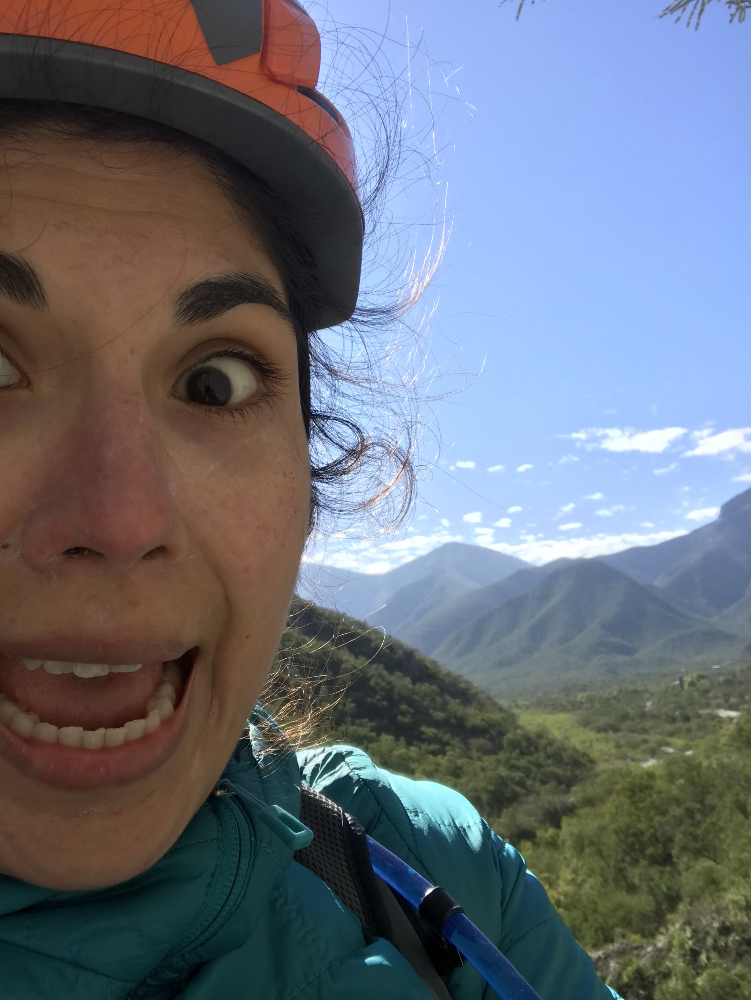
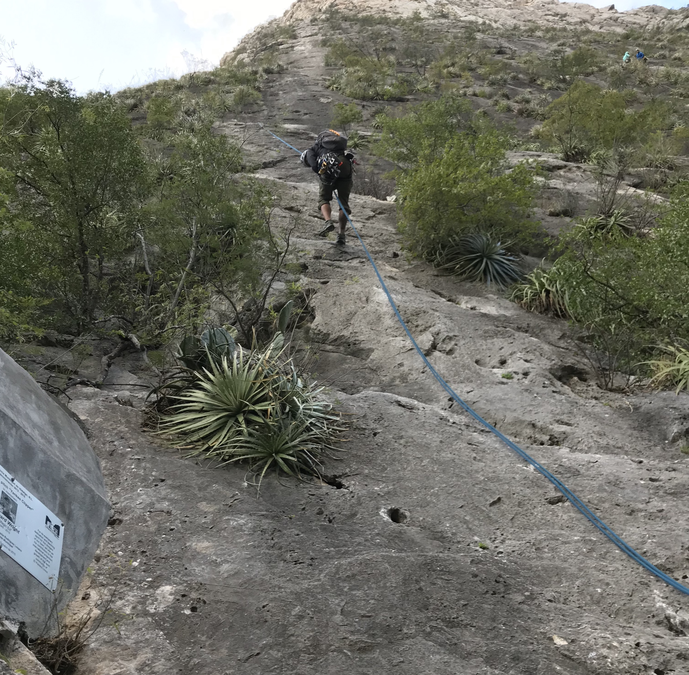

## The Little Corral

I learned about this place April 2017 when I was walking up to the summit of Angel's Landing with a group of Spanish-speaking people walking behind me. Curiosity got a hold of me and I turned around to ask where they were from. "De Mexico," they replied. My eyes lit up and I started to make conversation with the group about their plans in the states. I also mentioned that my family is from Mexico, but that I was 10 years old the last time I had visited. My family has majorly moved to North Carolina and my grandparents passed away since then. There hasn't been too much motivation for me to revisit.

Whenever I make the effort to push myself out of my comfort zone to speak to a stranger, I like to ask for their recommendations about an area. I took this opportunity to pose this question to the group: If I wanted to visit Mexico and see something like **this** (as I spread my arms to try to encompass Zion's main valley) or do some hiking or maybe climbing, where should I go?

There was no hesitation in their response. If I wanted to go climbing, I should definitely go to _El Potrero Chico_ because of its fame among climbers, reputation for one of [Alex Honnold's successful free solos](https://www.youtube.com/watch?v=Phl82D57P58), and all around beauty.

I immediately added it to my bucket list Trello board when I got back home from my Zion adventure.

Since then I've floated the idea of climbing in Mexico to several friends but never really acted on getting the ball rolling. We've been outdoors several times in California since then. March 2018 was the first time we visited Bishop, CA, for the [Women's Climbing Festival](http://flashfoxy.com/wcf-bishop) and were enamored with the beauty of the land as well as accessibility of the climbing. We returned again for #Climbsgiving in November 2018 to give some outdoor leading a go in Owens River Gorge, as well as paying a visit to Alabama Hills.

It's always a joy to get out of the city and share incredible experiences with friends outdoors.

## Travel Bug

This new year had me feeling like I was missing out on something but I couldn't figure out _what_. I started to replay the things I had done in the last year and remembered this being the time when I started getting a travel bug. I said yes to the first thing that anyone mentioned to me and found myself in Banff in the thick of Canadian winter. If you know me, you know I absolutely despise being cold, but the travel bug knows no discomfort.

The travel bug started me getting back to researching trips to El Potrero Chico. I floated the idea around and there seemed to be interest but no real drive to commit. It felt too soon to try to plan anything in the next month or two, but there were already too many other commitments in the rest of the year (weddings, music festivals, concerts, conferences, etc).

I almost let the plan fall through but I kept the flight itinerary opened in a tab and information about climbing guides in another. I started _talking_ about the idea of going to Mexico to several people. My engineering manager, friends, friends of friends. There was a little voice in the back of my head that kept saying: just book the flight.

The day [this article about millennial burnout](https://www.buzzfeednews.com/article/annehelenpetersen/millennials-burnout-generation-debt-work) began to become viral on Twitter, I started to read it and got to the graphic of a rope on the brink of breaking when I thought, _just freaking buy the flight_. I stopped reading the article because I couldn't identify with it as a person of color, but the thought of feeling burned out alone drove me to realize I needed to get away by myself.

So I booked the flight and immediately felt the rush of adrenaline. The last time I was partially alone for a wedding I went to in Bali in August 2018. I started to remember the agony and excitement I used to feel when accepting the request to travel alone as a software consultant. The rush was winning at this point and the plan was in motion. I quickly tabbed over to [Potrero Chico Climbing Guides](https://potrerochico.com/prices/) and booked a day of multi-pitch climbing. Who was I?? Just a few weeks before I laughed at the thought of doing any sort of big wall climbing when I met someone at Dogpatch Boulders visiting from Mexico City and here I was booking a trip to go multi-pitch climbing only a few weeks out. The travel bug is strong, there was no time to think about and be terrified by how high I could possibly get.

Having booked a flight and a guide, I remembered I needed a place to stay. I am swooned by nice web design so [La Posada](http://www.elpotrerochico.mx/) charmed me immediately. I put in a request for a private room. I wasn't sure how the temperatures would be and didn't want to find myself freezing in a tent under the Mexican skies.

## El Jungla de Asfalto

The next step was to vary the trip as a whole and spend some time in the urban jungle. Having read [_Down and Delirious in Mexico City_](https://www.goodreads.com/book/show/9733238-down-and-delirious-in-mexico-city) in 2015 gave me some insights into where I would go if I were to want to spend some time in CDMX (which I had previously known as El DF). I scoured Airbnb for a room in [Condesa](https://en.wikipedia.org/wiki/Condesa). I booked a small room with a host that ecstatically received my request after I mentioned I would be climbing the days before arriving and also mentioned he para-glides on the regular 💁🏻‍ and many of his friends are also climbers.

The trip was coming together and I started to wonder what I wanted to get out of it. I had never really asked myself _what do I value when I travel?_

The question itself made me feel uncomfortable for the sole fact that I wouldn't be getting anything out of the trip if I didn't know what to value from it before going. I had some thoughts about this in the weeks leading up to the trip and what I have found the most enjoyable but difficult part of travel is forcing myself to feel uncomfortable. Uncomfortable with speaking to strangers, being alone, getting lost and finding my way again, and on this trip, facing a fear of heights and falling several feet to my death.

## Feeling at Ease in Nuevo Leon

Aside from a system outage with Interjet and having to go through security with a handwritten boarding pass at SFO, my flight to Nuevo Leon was one of the most relaxing experiences I've had traveling alone. Both of my flights were empty enough for me to have a whole row to myself. I got to La Posada way after dark and right before midnight and got into bed excited and worried that I would be too tired to feel great about multi-pitching the next morning. The 8:30 am start worried me to the point where I was only able to partially fall asleep throughout the night.

I woke up an hour before I was to be ready to get my gear together and join other climbers in the communal kitchen to make some coffee. Rudy, my climbing guide, later walked in to La Posada's restaurant where I hoped to have a quick breakfast before our departure and said we should start around 10 am instead because it was "_a bit chilly_". The climber sitting next to me at the bar having coffee turned around to say _a bit chilly_ was an understatement. I was happy to know I was not the only delicate flower around when it came to climbing in the cold. :upside_down_face: Starting at 10am was no problem because the sun didn't set until after 6pm, so we would have plenty of time to climb. Rudy walked away after we agreed to meet again right before 10, but didn't disclose what route we'd be doing.

## Making New Friends

The neighboring climber eavesdropped into Rudy and my conversation and asked where I was flying in from and what climb we'd be doing. After I mentioned the options I've been told ([Estrellita](https://www.mountainproject.com/route/105961980/estrellita), [Satori](https://www.mountainproject.com/route/106198915/satori), or [Yankee Clipper](https://www.mountainproject.com/route/106081566/yankee-clipper)), the climber exclaimed, "There's no way you're doing Yankee Clipper, that's a 12a!" So I immediately wrote it off.

I did not catch the climber's name, but I learned he was a physician assistant from Bend, OR. His skepticism and sarcasm about what I did and where I was from was more than I would have asked for with my frijoles y huevos.

**"Software engineer? C'mon give me something original!"**

"Software engineer _for doctors_"

**"Why are you coming out here? Don't you have enough climbing in Yosemite?"**

**"What are you reading? Is it about climbing?"**

"Uhh.. no... It's called _Bonk_."

**"Oh. :neutral_face: Yea I've heard about that book."**

I later came to realize that talking to older climbers while I was in EPC put me at ease in having people to talk to and learn from.

During all of my meals, I was accompanied by several older climbers from Seattle, Oregon, and Canada. Many of them were EPC regulars and were taking month long or indefinite breaks from work. Shout out to Mari & Tom, Annette & Jerry and their two dogs and Siamese cat for the company! They give me hope that age should be no barrier for doing some epic shit.

## Escalada Multi-largo

I was completely wrong. Multi-pitch is amazing. I want to do it again and again and again. There was no time to be scared of heights after I started my second pitch because the canyon was too beautiful to keep my eyes on the wall.

```grid|3|


```

We did end up doing Yankee Clipper,but we did not do the full 15 pitches. I am proud of the 9 pitches we did complete and having a patient guide to explain every step of the process to me as well as some of the history about climbing in EPC and future developments of keeping it safe for people to enjoy.


Despite feeling like I didn't get enough sleep, climbing on limestone felt geat. I found myself [_mantling_](https://frictionlabs.com/blog/how-it-works-the-mantle) for a majority of my moves which left me with a lot of energy in the tank for subsequent pitches and confident in being able to find the right foot hold to reach up to holds that felt too far away. Sticky feet are so nice :ok_hand:. The sun was on our backs for major part of the day with a breeze that made climbing in the sun a pleasant experience. With every pitch, however, my [Miuras](https://www.sportiva.com/activity/activity-climbing/miura.html) felt less like gloves and more like hot irons suffocating my feet from getting proper circulation to my toes. Exciting, right?

I couldn't wait to get to the 9th pitch so that I could switch into slip-on sneakers for the decent.

## The Descent

I tried to not think too much about how we would get down. This was my first multi-pitch AND rappelling experience. From other stories, I'd known that rappelling was the cause of a lot of climbing accidents so I was immediately apprehensive as we started to set up our gear to start the rappel. My guide would go first and wait for me on the 8th pitch below. He asked me if I had any questions and I repeated everything I needed to do before lowering. Clean the anchor, clean my Personal Anchor System (PAS), clean my backup PAS, push the [Prusik](https://en.wikipedia.org/wiki/Prusik) down. Most importantly, trust the system. I failed to notice a critical step in the whole process. Push the rope towards the wall to allow the [ATC](https://en.wikipedia.org/wiki/ATC_(belay_device)) to slide down the rope. 🤦🏻‍♀️


After yelling down to my guide that the ATC was stuck and questioning whether the orientation of the ATC was at fault, I clipped my PASs back in and waited patiently as clouds rolled in and the wind picked up. This would be the second time I would intentionally open the breathe app on my Apple Watch in the last two weeks to _calm the fuck down_.

My guide re-appeared over the ledge we had been standing on together 30 minutes before and began inspecting the system. He verbally walked me through the alternative approach we would be taking, the [simul-rappel](https://www.climbing.com/skills/how-to-simul-rappel/),
and pushed into the rope to see what the issue with the ATC may be. When he did that and the ATC moved, I realized my ignorance. 🙈 :poop:

The simul-rappel made me feel much more comfortable with what we were doing. We worked as a team to lower, counter-balancing each other along the way and flaking the rope together at the next anchor to begin lowering again.



The final pitch I was to go alone and use the solo rappel technique, by this time I was a pro and comfortable with what I was doing. The first few steps on flat land felt weird!

In short, I'm already looking forward to my next multi-pitch experience and second visit to El Potrero Chico to try some of the other moderate routes in the area.


## EPC Beta

Getting to and from EPC was a breeze after I found the proper resources and information to make me feel well informed about the trip. I didn't explore much outside of La Posada and the park itself during my two-day stay but I felt like I made the most of what I had available to me.

### Airport Transportation

You can arrange a taxi with La Posada along with your reservation. The price of one way can be a sticker shock at around \$60 excluding tolls. You can also find locals that run their own taxi services such as [Joe Bert Guadarrama (Pop Joe's Climbing Shuttle)
](https://www.facebook.com/POPJOESCLIMBINGSHUTTLE/) and [Portrero Chico Climbing Guides](https://potrerochico.com/shuttle/).

### Meeting Other Climbers / Asking Questions in Advance

There's a Facebook group called [Potrero Chico Rock Climbing](https://www.facebook.com/groups/potrerochicorockclimbing/) where and local businesses announce events (such as movie, karaoke, or salsa nights). For the most part, posts are from climbers putting in requests for partners, gear for sale (to lighten the load back home), or lost and found gear. Following along with the discourse in the group made me feel well informed about what was going on in EPC before I arrived.

### The Approach

I expected the approach to be a hike, but if you happen to hitch a ride, most of the approaches are less than 60 seconds from where you park. If you stay at La Posada or any of the _casitas_ outside of the park, you're only a short walk away on a paved road. You don't really need any hiking shoes if you plan on just climbing. Rappelling in slip-on canvas shoes felt like a luxury.

### Hikes

Given the short trip and my lack of experience and gear, I opted to go on a hike the second day I stayed at La Posada. The trail I took took me to the summit of [El Toro](https://www.wikiloc.com/hiking-trails/el-toro-potrero-chico-16258416). I had heard an older couple talking about their experience with it the night before while having dinner at [Leo's](#shop--dine), and they looked absolutely exhausted. Their spirits were high and they praised it for the views. At the time, I wasn't aware that they were describing the hike I would be doing the next day.

[Rudy and Karla](https://potrerochico.com) were very helpful in driving me to the trail head that morning, without them I would have probably never found it despite some [detailed instructions](https://potrerochico.com/potrero-chico-rest-day/) on their website. While we walked to the start of the trail, I mentioned the couple the night before talking about El Toro and Rudy replied, "yup this is it."

As I started to disappear into the bushes, Rudy warned me that it was easy to lose sight of the trail in the first 5 minutes or so, but that I would eventually find the trail and the rest of the hike would be well marked. He was totally right, and I have several scrapes on my arms and legs to prove my attempt to bushwhack my way to any cairn I could find.


The hike was way more exhausting than climbing for the 2+ miles straight up a mostly exposed trail lined with cacti and thorny bushes and 2+ miles back down. The steepest parts of the trail were covered in small gravel rocks, making it difficult to just run down. Each step felt precarious for me, but was often in vain when a rock rolled either of my feet out from under me.

### Shop & Dine

The town of Hidalgo has many restaurants and grocery stores where you can get food, coffee, and cash. Most people are nice enough to give you a ride if you happen to catch their eye as they drive by, otherwise it's a 40+ minute walk down the hill and another 40+ minute walk up the hill. For a more informed guide, check out some [rest day beta](https://potrerochico.com/potrero-chico-rest-day/) from Potrero Chico Climbing Guides

My curiosity for coffee shops and need for cash almost convinced me to make that walk after slogging my way up to El Toro, but I discovered I could exchange the $20 USD I had on hand at the main office at La Posada. My need for cash was only to pay back for a home-style dinner I had next door at [Leo's Tacos Grill](https://www.facebook.com/LEOS-TACOS-GRILL-791284507672369/) the night before and to have the ability to eat there again. The two meals at Leo's only set me back $16 USD and some change. What I loved about it, I talk about in a [later post](/antojitos-mexicanos).

### What Would I Differently?

* Stay longer and bring friends (or make friends)  so that I can climb more. 😬
* Rent a car: airport transportation is overpriced. Having a car on hand would make it easier to drive to the crag and into town for food.
* Cook more. Although meals were a steal compared to dining out in San Francisco, cooking in the communal kitchen at La Posada would make it easier to eat on my own schedule. Sometimes I just want to eat dinner and crash, but in Mexico meal times are a few hours delayed compared to our feeding rituals in the US and kitchens open to accommodate the later crowd.
