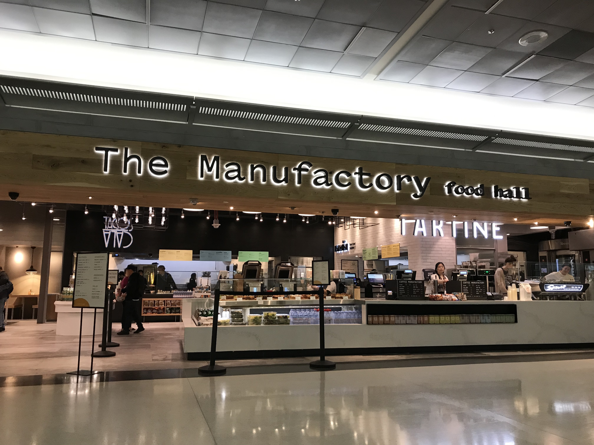
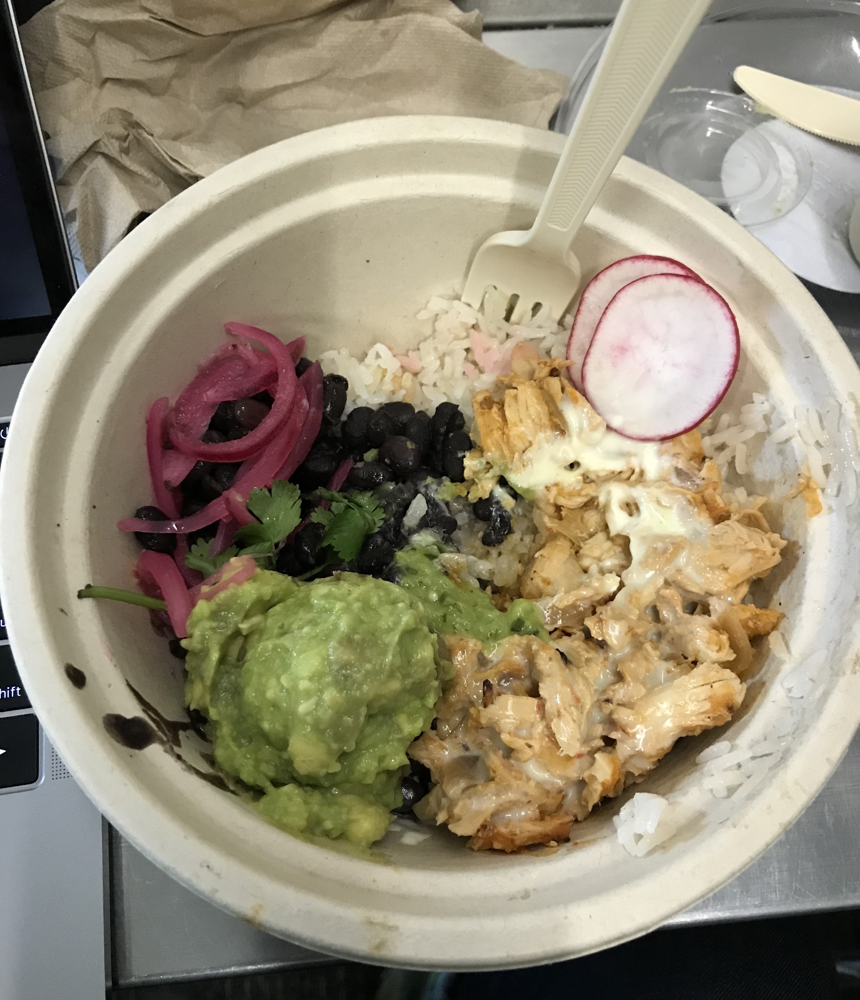
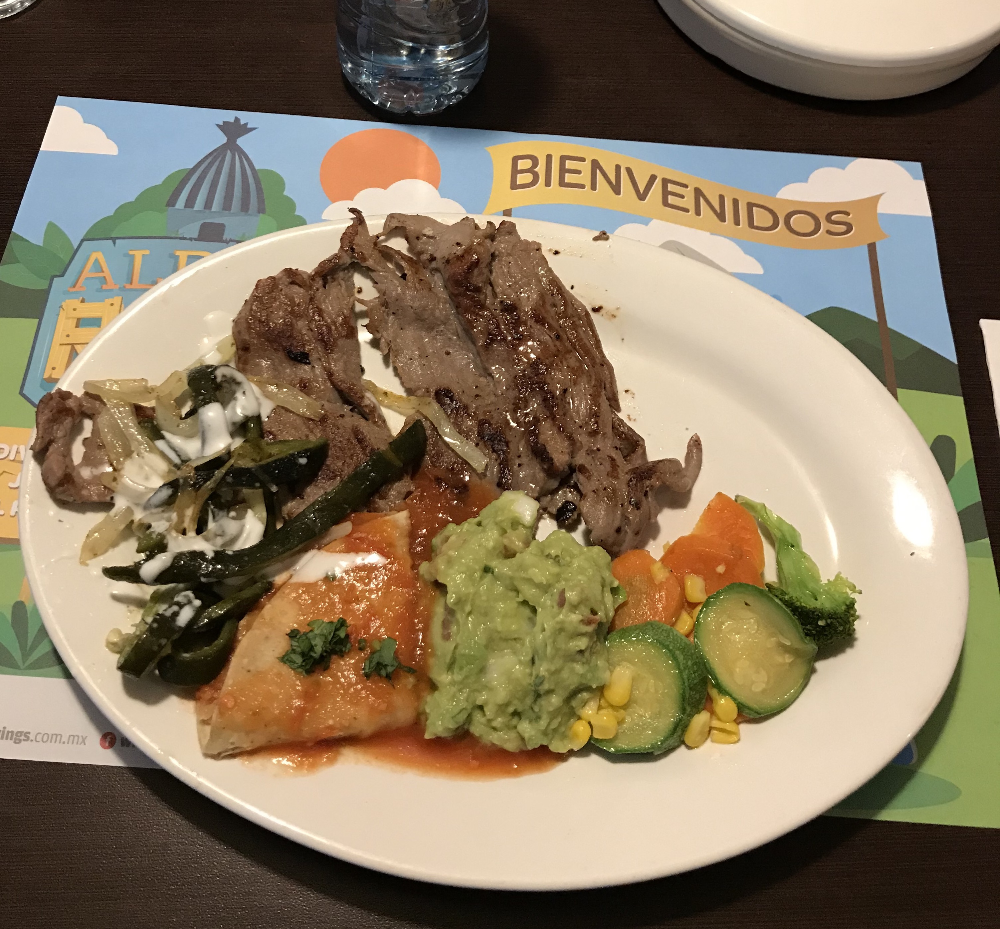
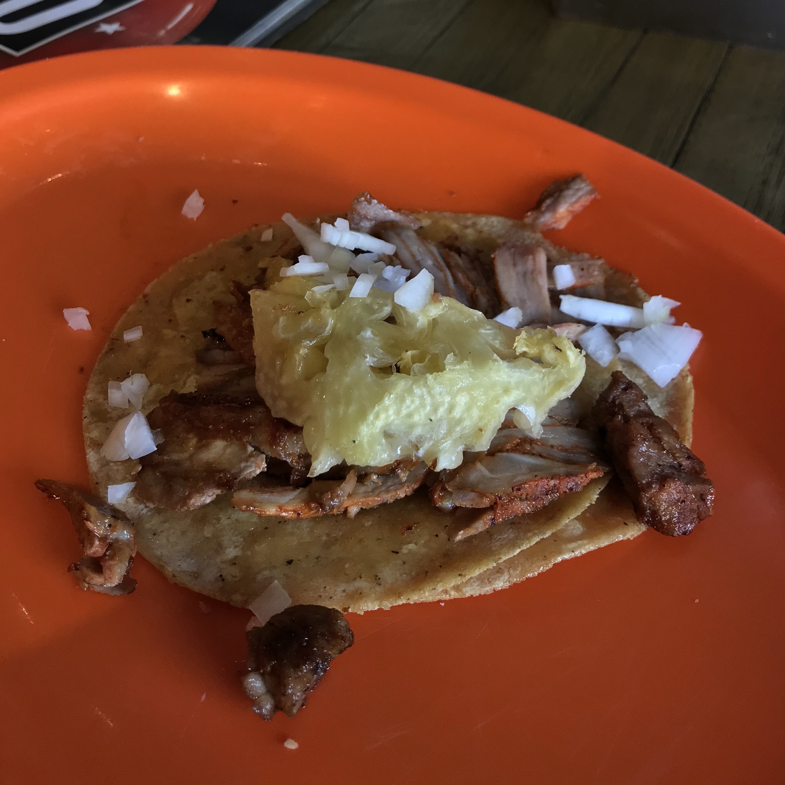
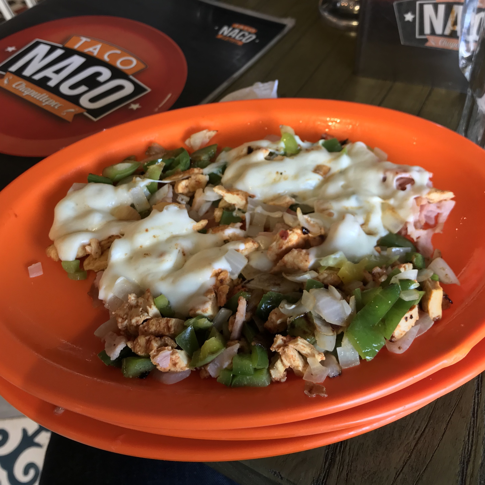
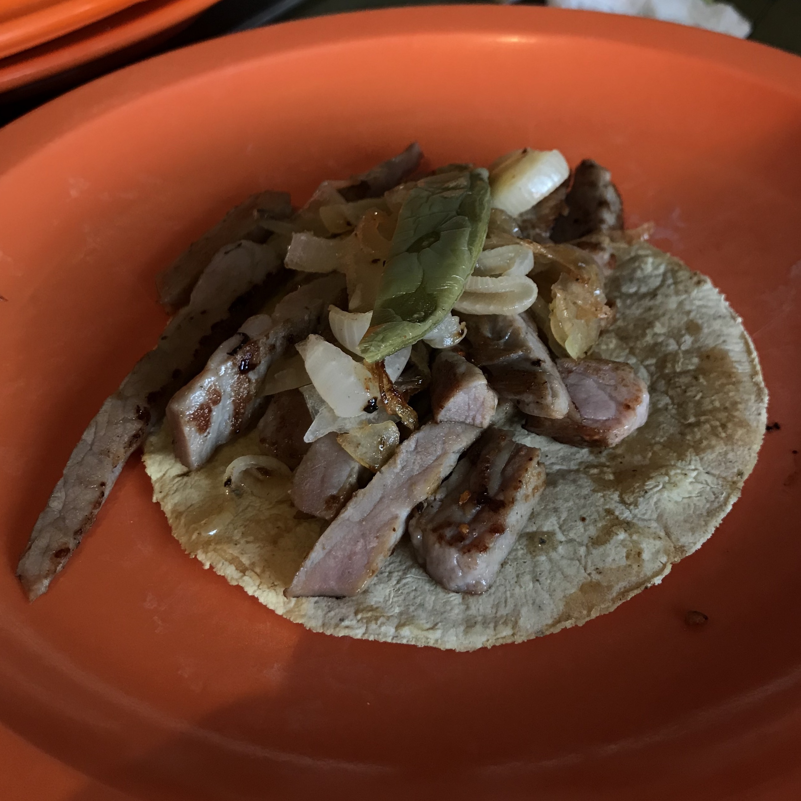

Wikipedia defines [_antojitos_](https://en.wikipedia.org/wiki/Mexican_street_food) as Mexican street food, snacks, or "little cravings". The non-diminutive version, _antojo_, means craving. One of the primary activities during my visit to Mexico was to satisfy my cravings for good Mexican food and seasonal dishes that my family hasn't exposed me to.

When I travel, I often discriminate businesses based on their ability to take credit card payments. On this trip, however, I knew places that are cash-only would likely provide the best "comida casera" (homemade or home-style food).

I started the trip off with two big healthy doses of Tex-Mex via airport meals. The first would be a chicken bowl from the new Tacos Cala in the new Manufactory Food Hall in the SFO International Terminal. The second, a plate of [_arrachera_]() meat and veggies at a Wings restaurant in the Guadalajara (GDL) airport. They were not exciting meals but they provided sufficient sustenance on the 9 or so hours of travel I had to surpass before arriving to my final destination.

```grid|4|



```

A lot of my meals would end up looking the same, with some exception of some _gringa_ cravings I had for breakfast.

## Breakfast

## Lunch

## Dinner

### Taco Naco

This was my first meal in Mexico City after sitting in an Uber Pool for what felt like 2 hours to get to my Airbnb in Condesa from the MEX airport. I was _hangry_ and was reaching the limits of my patience after chewing several pieces of gum and having little water. I even tried to get cash from a OXXO mart in the area so I would be prepared to eat at whatever taco stand I could find, but after finding a broken ATM and walking in the wrong direction a couple times to get to a bank, I decided Taco Naco would do and was relieved they accepted credit cards. Once I finally sat down, I realized I was essentially eating an early dinner at 4pm.

Al pastor tacos are my favorite type of taco and it is my method of measuring how good a restaurant's tacos are compared to other taco joints I've been to in the past. Taco Naco's taco al pastor was pretty damn good. Pineapple on everything, por favor.



To accompany the taco al pastor, I also ordered an arrachera taco and alambres de pollo al pastor. I am always confused by the definition of alambres. My brain translates alambres to wires as in TV antennae wire, and I picture kebabs. What I got was definitely not that, but I was not mad. Chicken sauteed with bell peppers, onions, bacon, and a heaping serving of melted Oaxacan queso.

```grid|3|


```

Taco Naco would be the first restaurant where I noticed the note of quantity of meat in each dish in grams. I really appreciated this because I could get an idea of how much protein I'd be getting in with each meal.

- Cost of meal:
- Method of Payment: credit card
- Feeling: hot and hangry
- Fun fact: naco means [insert definition here] in Spanish
- Address:
- Menu:

## Snacks
