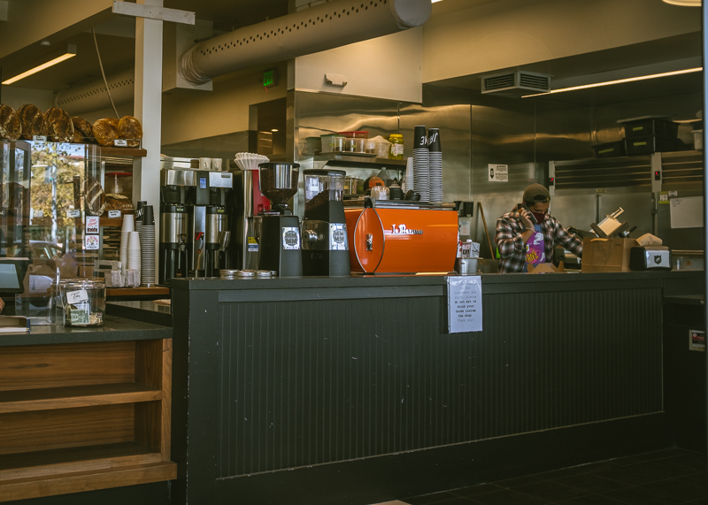
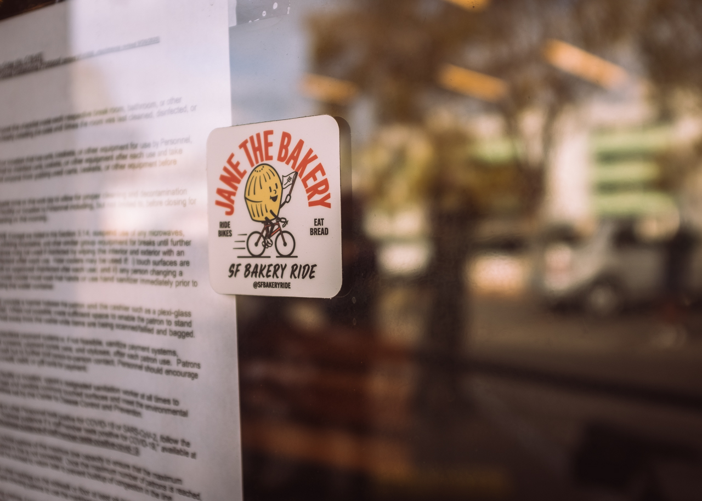

[1881 Geary Blvd](https://www.itsjane.com/location/jane-the-bakery/), Lower Fillmore, San Francisco, CA.

To find Jane the Bakery, look for a building that oddly looks like an old combination KFC & Taco Bell. In fact, it is! As of writing this post, a blacked out KFC bucket sign still hovers over the parking lot.

```grid|3|


```

Their parking lot has more than enough room for bikes and hanging out while you devour your baked goods.

```grid|3|


```

The line can seem long at times, but it moves fairly fast. Once you're inside prepare to have to make some hard decisions. The pastry case makes the first visit difficult if you're an explorer like me. However, once I find a menu item I like at any restaurant or bakery, it's hard for me to deviate.

```grid|3|


```

```grid|2|


```

Jane excels in both the baked good and hot beverage departments. You can grab a buttery pastry and hot coffee, espresso, or tea to snack outside while you figure out how to transport the loaf or baguette you might impulse buy home.

```grid|3|


```


<p style="text-align: center"><em>Olive polenta loaf. The attendant recommended cutting a thumb-sized hole in the middle of a slice and pan frying it with an egg in the middle.</em> <br/>:camera: by <a href="https://www.instagram.com/stevo_chang/">@stevo_chang</a></p>

#### Jane, you had me at spicy sausage

I've always felt welcomed by Jane's amiable staff. On one occasion, my attendant's eyes grew with excitement with my decision to go with a spicy sausage and Swiss cheese croissant. This was her favorite pastry of the moment and the excitement was a good sign that I would enjoy it.


<p style="text-align: center">:camera: by <a href="https://www.instagram.com/stevo_chang/">@stevo_chang</a></p>


I fell into the sweet side on another visit a few days later after feeling curious to find out what a _Cardamom Lattice Bun_ might be. It's great. Flaky laminated pastry with a delicately sweet cardamom cream surprise. Cardamom fans, you won't be disappointed.

```grid|4|


```

I must admit that I often breeze by Jane the Bakery on my way home from morning rides north of the Golden Gate Bridge. During the month of November, however, I feel like a regular thanks to [SF Bakery Ride](http://sfbakeryride.com/) and friends that look forward to a casual adventure with other pastry enthusiasts to support local businesses and [youth cycling programs](https://outridebike.org/).


