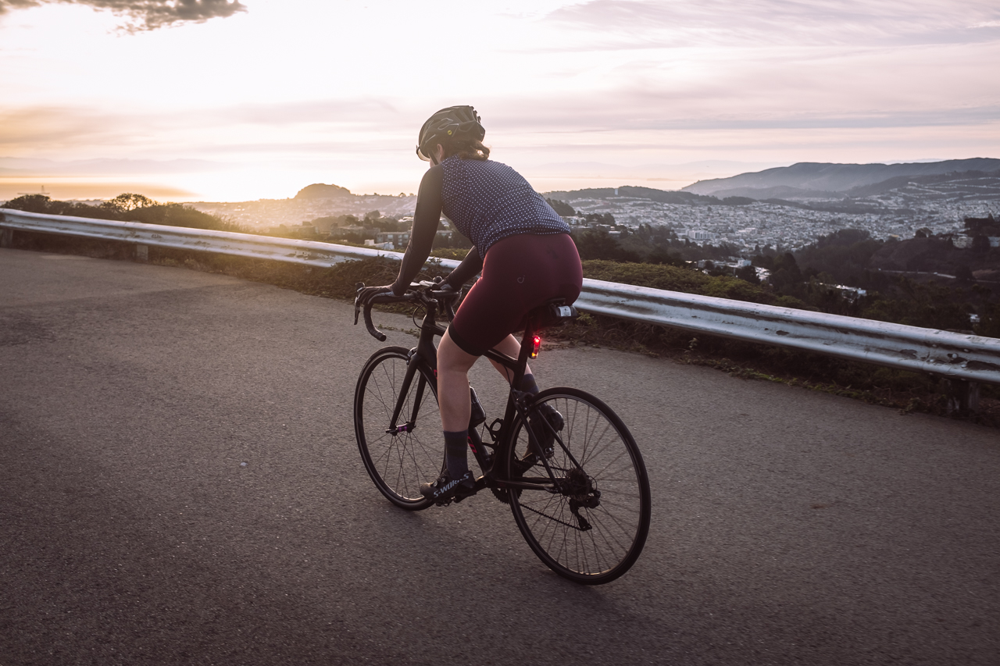
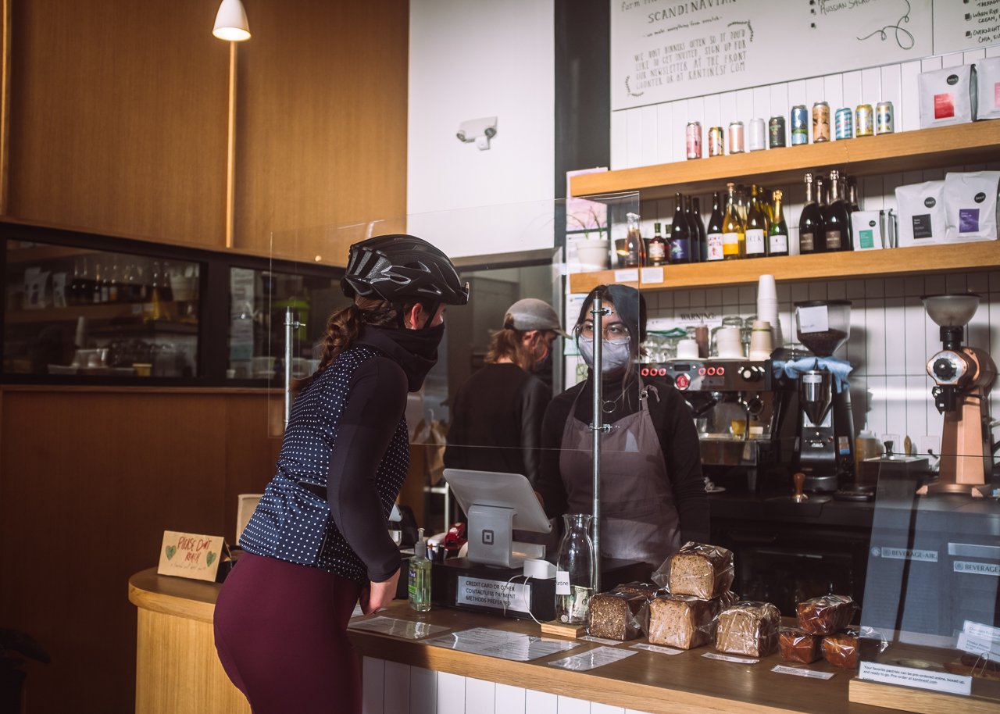
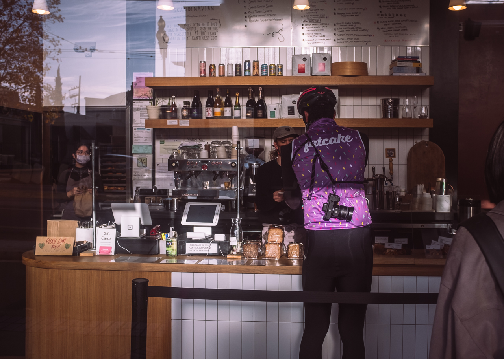
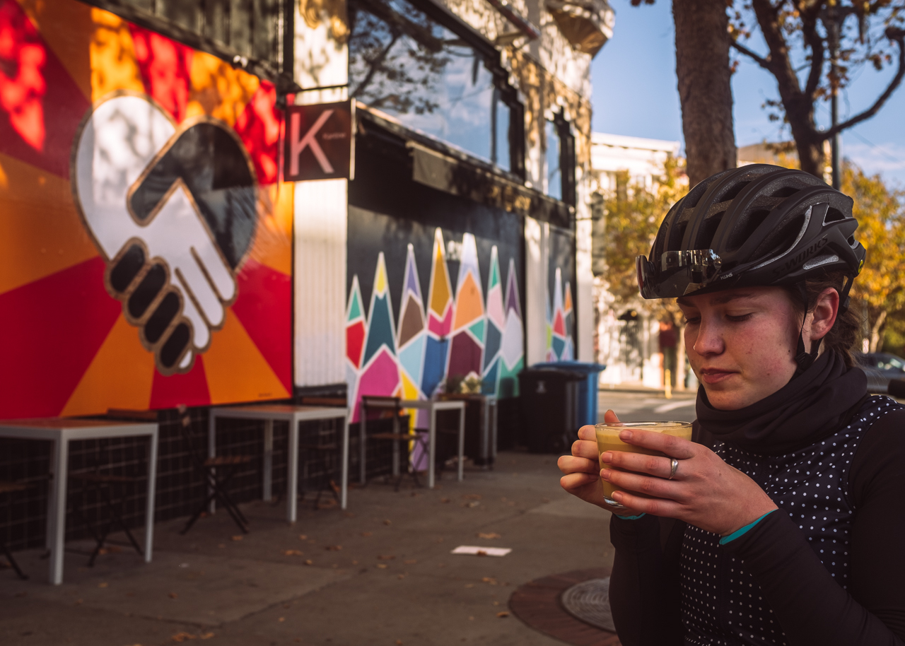
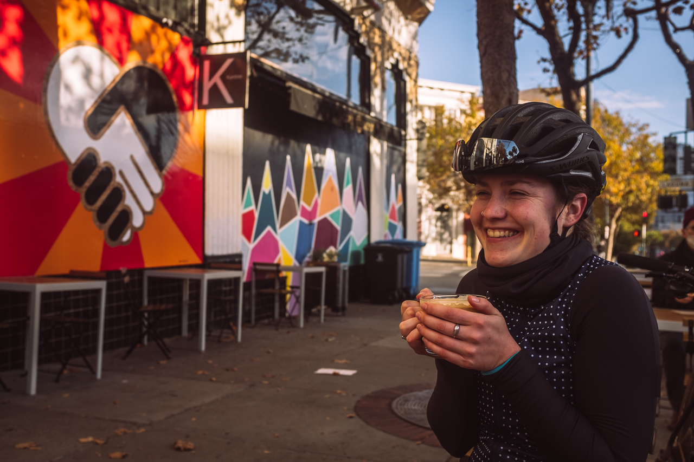
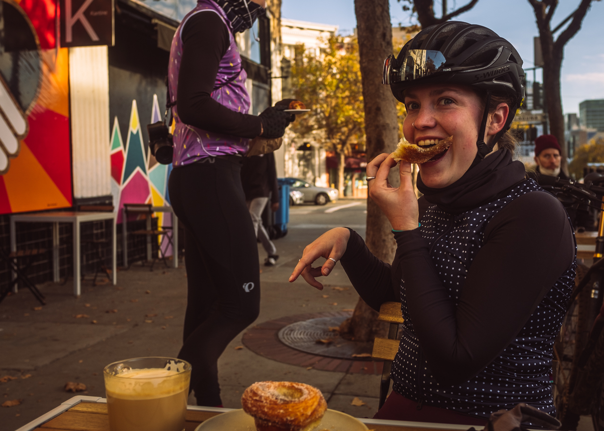
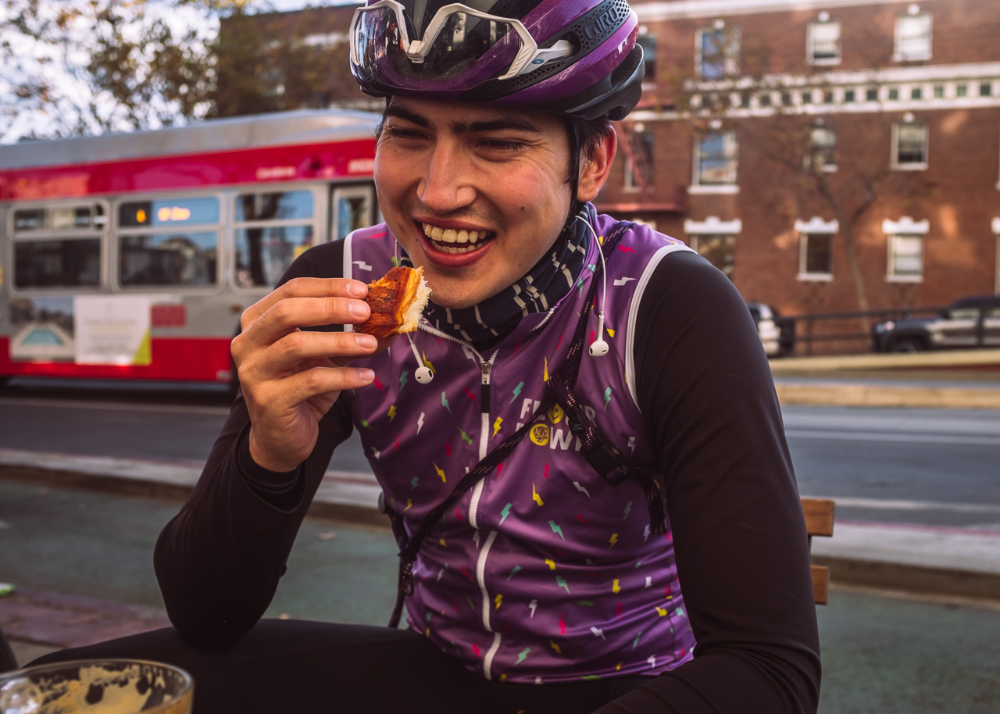

For some of us, the Upper Market Street hustle may be a memory of an afternoon commute of a past era, but this gasping commuter hill still holds some gems to check out.



Next time you find yourself on top of Twin Peaks on a brisk morning, look out on to Market Street and you might be able to spot Kantine. From there, the routes to get there are endless. If you're feeling like a rocket ship, descending Twin Peaks and taking a lane from the top of Market Street will get you there in no time. For a photo pace route, Ashbury, Page, and the Wiggle will let you sort out what you want to order once you arrive.

Kantine is a Scandanavian gem that can be easy to miss, but stopping is worth the break with plenty of space for bikes and outdoor dining.


Kantine's comforting spread of Scandinavian dishes, breads, pastries and coffee have been around since 2018 and before that as a regular pop-up at the Ferry Building farmer's market.

```grid|3|


```

Kantine's pastries are ones that are unique in the line up of never-ending bakery options in San Francisco. The cardamom morning bun is a favorite go-to for some of Kantine's Fat Cake regulars, but you'll find that the pastry case holds some options for both sweet and savory cravings.

```grid|3|


```

Seasonal finds are also common! Can't wait for creamy, marzipan delight that is semla to make its return next year.

```grid|3|


```
