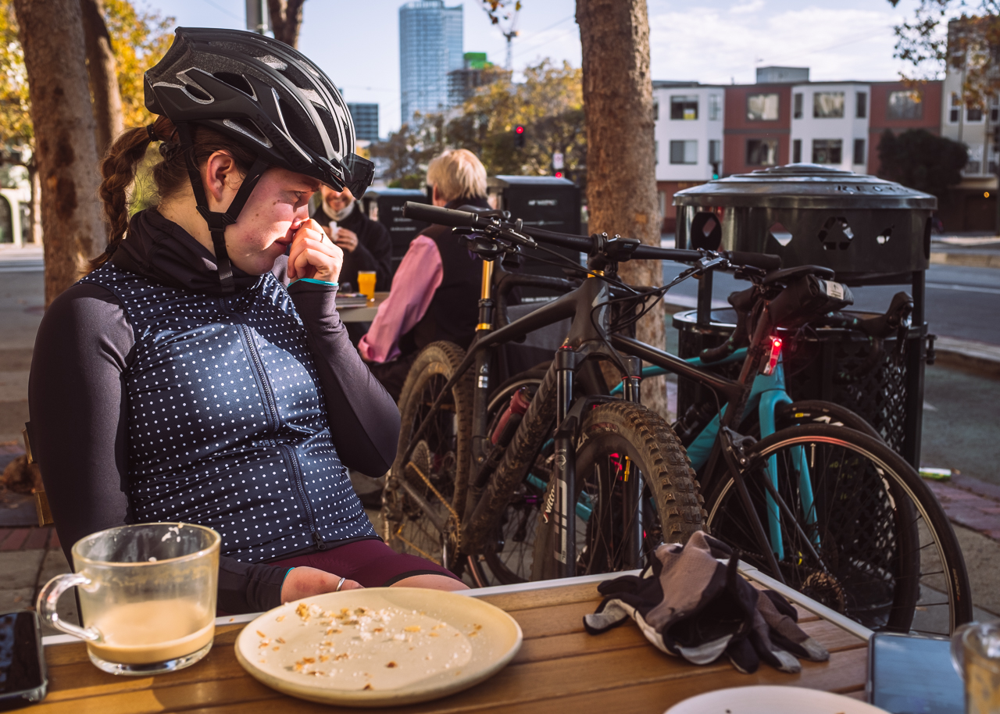
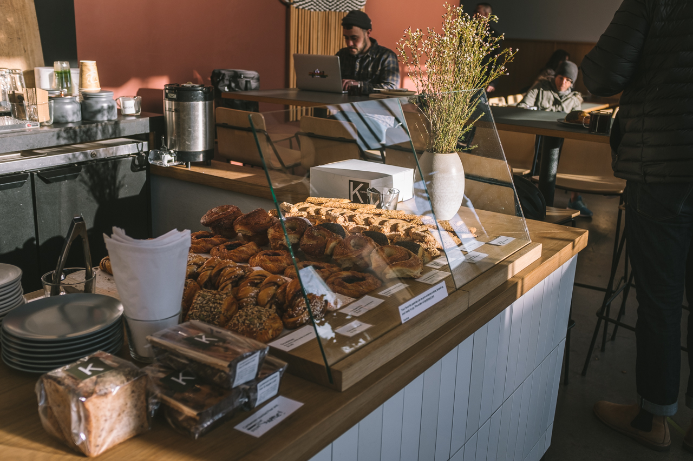

Next time you find yourself on top of Twin Peaks on a brisk morning wanting a warm beverage and pastry, look out on to Market Street and you might be able to spot Kantine. From Twin Peaks, the routes to get to Kantine are endless. For a fast-paced adrenaline rush, descending Twin Peaks and taking a lane from the top of Market Street will get you there in no time. For a leisure/photo-pace route, you can take Ashbury, Page, and The Wiggle to give you time to sort out what you want to order when you arrive.

For some of us, the Upper Market Street hustle may be a memory of an afternoon commute of a past era, but the gasping commuter hills still hold some gems to check out. Kantine is a one of those gems that can be easy to miss, but stopping is worth the break with plenty of space for bikes and outdoor dining.



Kantine's comforting spread of Scandinavian dishes, breads, pastries and coffee have been around since 2018 and before that as a regular pop-up at the Ferry Building farmer's market.

```grid|4|



```

Kantine's pastries are ones that are unique in the line up of never-ending bakery options in San Francisco. The cardamom morning bun is a favorite go-to for some of Kantine's Fat Cake regulars, but you'll find that the pastry case holds some options for both sweet and savory cravings.

```grid|4|


```


Seasonal finds are also common! Can't wait for creamy, marzipan delight that is semla to make its return next year.

```grid|3|


```
