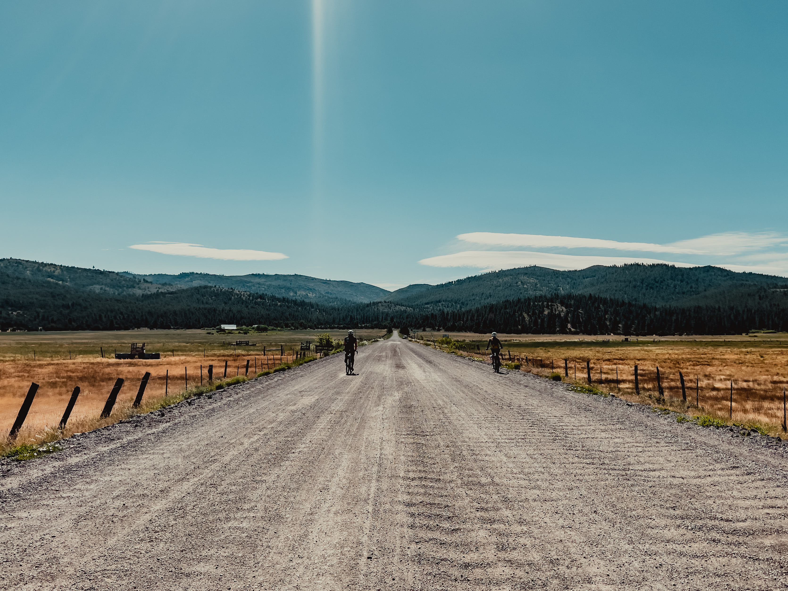

Yee-haw! Bear Valley is an area north of Truckee, CA that I visited with friends last June. The weather was hot and water was sparse but the views, [ride shenanigans](), and camp hangs made me look forward to a repeat this year. 

### TL;DR
* Book the campsite: [Cottonwood Creek Campground](https://www.recreation.gov/camping/campgrounds/232871)
* Ride either of these routes: [2021](https://www.strava.com/activities/5466195059), [2022](https://www.strava.com/activities/7298858546)
* Pack extra water as the creeks may be dry later in the summer.


<p style="text-align: center; font-style: italic">Footage from 2021. Go fast, don't die.</p>

The group was much smaller this time around thanks to COVID taking its toll on a lot of my social circles. Having been recovering from my first cold since 2020, I was looking forward to going on any adventure after being sidelined for a few weeks.


Like last year, we rolled into [Cottonwood Creek Campground](https://www.recreation.gov/camping/campgrounds/232871) after sunset due to work responsibilities and Friday traffic leaving San Francisco. This campground serves as a great basecamp for the loop we were riding because it sets you up to have a paved descent at the start and end of the ride. I had a newfound admiration for the area after discovering there were more areas and peaks to explore in [Cycling the California Outback](https://mmbhof.org/chuck-bodfish-elliot/) in addition to new camp gear to test.

```grid|2|


```

While a few of us had some suspension on our bikes last year, the terrain doesn't need more than a bike with fat tires. For this trip, Quinton and I were on our gravel bikes with 42 and 48mm tires respectively, while Janie was rolling on 2.25in. 

```grid|2|


```

Knowing how cracked I was last year after the group took a detour to Loyalton for more snacks and water, I made a note to pack extra fork mounted water as well as something for lunch and extra snacks this time around.


```grid|3|


```

The trails in the area lend themselves to criss-crossing at the summit of Bear Valley Campground, where you could stash extra food and water to pick up later on, but I didn't mind riding with an extra 2 liters of water. I was already one 22oz bidon down by the time we summited the intersection the first time due to the heat and elevation we're not used to coming from SF.


```grid|3|


```

Mellow was the name of the game this time around especially since my cold's congestion seemed to creep back overnight. I highly recommend sitting down midway for lunch, taking your shoes off, and even taking a short siesta in some shade as we did to appreciate and talk about the the foliage along the ride and meadow of wildflowers we were facing. 

```grid|3|


```

The beginning of our route on Lemon Canyon Rd. was marked by pines, firs, and leafy plants reminiscient of a salad green that almost looked like they were crops. We even saw some snow on distant peaks and snow flowers ([sarcodes](https://en.m.wikipedia.org/wiki/Sarcodes)) during one of our pee breaks.


<p style="text-align: center; font-style: italic">We also had a good time cloud gazing and picking out a favorite cloud. This was mine.</p>

```grid|2|


```

```grid|2|


```

In 2021, we descended from Bear Valley Campground to Smithneck Rd and we had planned to do the same this year, but mistook Strava's auto-routing when recreating and actually did the opposite. I appreciated the slow climb much more because it let me take in how the valley is rehabilitating from previous forest fires. Around this time the charred tree trunks were surrounded by wildflowers and green grasses and shrubs. 


```grid|2|


```

On our second Bear Valley Campground summit, we discussed cooking an early camp dinner and heading to Campbell Hotsprings nearby in Sierraville. It wasn't clear if there were any opportunities to drop in or if we needed to make a reservation, but it didn't hurt to try.

```grid|2|


```

However, as I rolled back into camp on Highway 89, I noticed a family standing on the side of the road getting ready to dip into a roaring Cold Creek. We scratched our plans to go anywhere but across the street to take a refreshing dip in the water.

```grid|2|


```

I dropped my bike off, grabbed a snack, and put my Crocs in adventure mode to walk across the road and wade into the water and scrub all the grime I had accumulated on the ride. I relied on baby wipes last year, so the chill and almost numbing dip was a treat. The cold dip and camp dinner put me into a happy lull that I slipped into my tent for the night before the sun set. I live for that tired and happy feeling after a long day on the bike.
